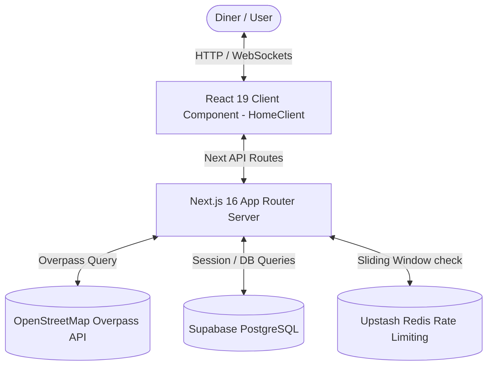
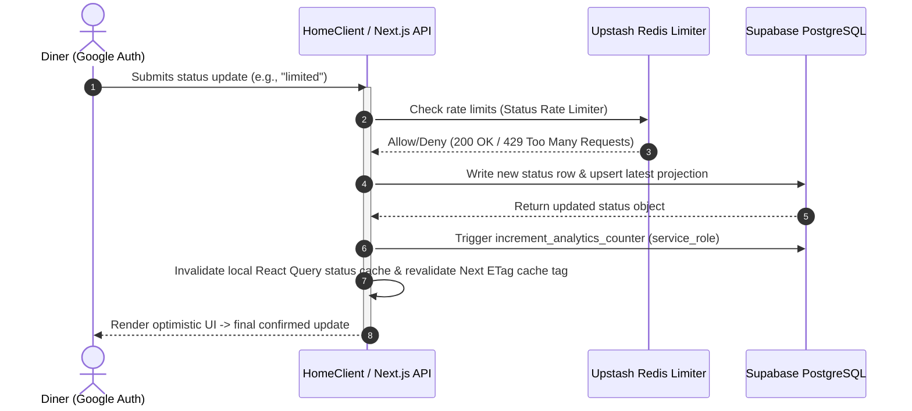

# GasUndo Repository Analysis

GasUndo is a real-time, crowd-sourced PWA web application built using **Next.js 16 (App Router)**, **React 19**, and **Tailwind CSS 4**. It maps and tracks restaurant availability and operating status across Kerala's 14 districts during LPG (cooking gas) shortages. The app allows users to check if restaurants are open, closed, or running on a limited menu, submit real-time updates, confirm existing statuses, and comment on restaurants.

---

## 1. High-Level Architecture & Stack

GasUndo is built on a serverless and hybrid architecture combining client-side rendering (with Leaflet maps) and cached server-side catalog compilation.

### Core Technologies
*   **Framework**: Next.js 16 (App Router, Node.js runtime).
*   **Frontend Library**: React 19 (leveraging features like `useDeferredValue`, dynamic imports, and transitions).
*   **Styling**: Tailwind CSS v4.0.
*   **Database & Auth**: Supabase (PostgreSQL database, Google OAuth via Supabase Auth).
*   **State Management**:
    *   **Zustand**: Client-side queries, filter states, and active selection.
    *   **TanStack Query (React Query v5)**: Manages catalog and status queries, mutations, optimistic UI updates, and caching.
*   **Mapping**: Leaflet, `react-leaflet`, and `react-leaflet-cluster` (client-side map visualization).
*   **Rate Limiting**: `@upstash/ratelimit` + `@upstash/redis` (sliding-window rate limits).
*   **Analytics**: Vercel Analytics + server-side daily and per-restaurant custom counters.

---

## 2. Directory Layout & Key Modules

### A. Core Routing & Views
*   `src/app/page.jsx`: The root route handler. It parses search parameters, loads the default or selected district catalog, builds SEO structured data (WebApplication, WebSite, FAQPage), and renders `HomeClient`.
*   `src/app/home-client.jsx`: The primary client controller shell. It orchestrates TanStack Query queries/mutations, keeps the URL query parameters (`?district=...&restaurant=...`) in sync with state, and handles map view centering, searching, and filtering.
*   `src/app/layout.jsx`: Configures the global viewport, fonts (Public Sans & Space Grotesk), PWA web manifest, startup splash images (iOS-compatible), and wraps the application in provider trees.

### B. Core Service Logic (`src/lib/`)
*   [restaurants.js](file:///c:/Users/amith/vellam.undo/gasundo/src/lib/restaurants.js): Fetches district-wise restaurant catalogs from OpenStreetMap's Overpass API. It parses restaurant/cafe amenities and shops matching `bakery` using regular expressions. Catalog reads are cached using Next.js `unstable_cache` for 24 hours.
*   [statuses.js](file:///c:/Users/amith/vellam.undo/gasundo/src/lib/statuses.js): Manages status updates and confirmations. If the `restaurant_latest_status` projection table is missing (or DB setup is incomplete), it dynamically falls back to reading/sorting from raw history tables.
*   [comments.js](file:///c:/Users/amith/vellam.undo/gasundo/src/lib/comments.js): Handles comment queries, paginated feeds (cursor-based), upvoting comments, and editing/deleting comments.
*   [ratelimit.js](file:///c:/Users/amith/vellam.undo/gasundo/src/lib/ratelimit.js): Configures separate Upstash Redis sliding-window limiters for different actions:
    *   `status-create`: 6 requests per 60 minutes
    *   `status-confirm`: 20 requests per 60 minutes
    *   `place-open` (analytics): 180 requests per 10 minutes
    *   `comment-create`: 6 requests per 10 minutes
*   [analytics-core.js](file:///c:/Users/amith/vellam.undo/gasundo/src/lib/analytics-core.js) & [analytics.js](file:///c:/Users/amith/vellam.undo/gasundo/src/lib/analytics.js): Implements custom server-side daily aggregate and per-restaurant telemetry using Supabase RPCs.
*   [districts.js](file:///c:/Users/amith/vellam.undo/gasundo/src/lib/districts.js): Defines geographic bounding boxes and map centers for all 14 districts in Kerala. Maps coordinates (`lat, lng`) to districts when users tap the "Locate Me" button.

### C. Database Layer & Migrations (`supabase/migrations/`)
*   `20260312000000_rate_limit.sql`: DB-backed rate limits (used as a fallback / legacy mechanism).
*   `202603130001_status_projection.sql`: Computes a deterministic `restaurant_key` from coordinates and names. Defines the `restaurant_latest_status` table acting as a projection to fetch status snapshots efficiently, populated via a PostgreSQL trigger (`restaurant_status_sync_latest_status`).
*   `202603130003_comments.sql` & `202603130004_comment_upvote_fix.sql`: Defines tables and indexes for comments and upvotes, plus RPC `add_restaurant_comment_upvote`.
*   `202603130005_status_confirmations.sql`: Handles check-ins to prevent users from confirming their own reports or double-confirming. Runs via RPC `add_restaurant_status_confirmation`.
*   `202603150001_analytics_counters.sql`: Telemetry tables for bucketed and per-restaurant analytics, security definer function `increment_analytics_counter`, restricted to the `service_role`.

---

## 3. Data & User Flow Breakdown

### Catalog Compilation & Caching Flow
1. When a user navigates to `/` or updates the selected district (e.g., `?district=kozhikode`), the app requests `/api/catalog?district=<slug>`.
2. The server calls `getRestaurants()`, which checks the 24-hour cache.
3. On a cache miss, it POSTs a structured query to the **OpenStreetMap Overpass API** querying for node/way/relation coordinates in that district.
4. If Overpass fails:
    *   If the selected district is `ernakulam` (Kochi), the server falls back to reading `src/data/restaurants-kochi.json`.
    *   For other districts, the request fails with an error message.
5. The catalog list is indexed client-side to map names and brands for auto-suggest/autocomplete searches.

### Status Update & Mutation Flow

---

## 4. Key Security & Operational Safeguards

1.  **IP & User ID Combined Rate Limiting**: The rate-limit keys are generated by hashing the client IP and the authenticated user's ID together (`buildRateLimitKey(clientIp, user.userId)`). This prevents script-based rate-limit exhaustion.
2.  **RLS and Security Definer RPCs**: Direct updates to tables like confirmations or upvotes are restricted. Modifications run via PostgreSQL functions configured as `SECURITY DEFINER` (executing with owner permissions while performing custom business logic validations, e.g., checking if the confirmer is the original poster).
3.  **Analytics Write Protection**: The analytics increment function is revoked from the `public`, `anon`, and `authenticated` roles, granting execute permissions exclusively to the `service_role` (invoked securely server-side inside API routes).
4.  **Cursor-Based Pagination**: Restaurant comments are paginated using an encoded cursor containing `created_at` and `id`, avoiding performance issues associated with large offset-based SQL queries.
5.  **Optimistic UI Updates**: Client-side status submissions and confirmations immediately update the local React Query cache state, so UI buttons reflect changes instantly while the network request resolves in the background.
